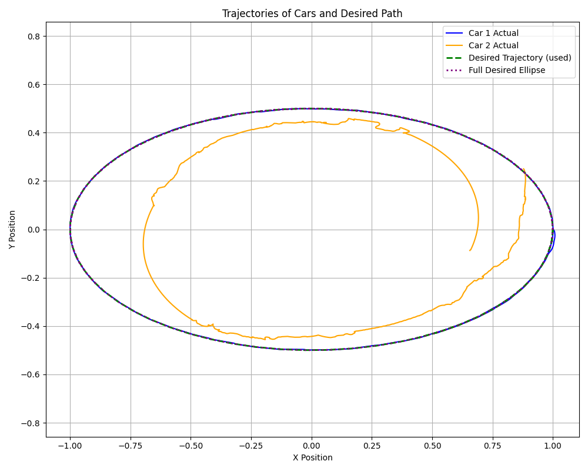

# Разработка алгоритма следования за лидером

## Установка
Необходимо клонировать репозиторий:
```
git clone https://github.com/GSAGift/PR.git
```
Необходимо установить виртуальную среду с зависимостями:
```
conda env create -f environment.yml
conda activate simrobs
```
Чтобы запустить симуляцию, необходимо выполнить команду в терминале:
```
python main.py
```
## Описание проекта
Данный проект был подготовлен в рамках изучения курса Программирование роботов. 

В проекте реализован алгоритм следования за лидером. Управление лидером и последователем осуществляется с помощью ПД-регулятора. Лидер движется по заданной траектории. 

Последователь держится на некотором заданном расстоянии от лидера. Последователь считывает QR-код лидера и рассчитывает расстояние и смещение по оси Х для задания управления.

Цель работы: реализовать алгоритм следования за лидером с использованием ПД-регулятора с помощью движка MuJoCo.

Задачи работы: 
1. Разработка физической модели машины
2. Реализация ПД-регулятора
3. Реализация отслеживания QR-кода лидера
4. Реализация движения лидера по траектории
5. Реализация алгоритма следования за лидером

## Описание основных функций
### Реализация считывания QR-кода
- `get_image_from_camera(data, renderer, camera)` - считывает QR-код
- `ind_displacement(qr_info)` - определяет расстояние до QR-кода по его размеру и координату смещения центра QR-кода от центра изображения по оси x
### Реализация управления
- `infinite_trajectory_generator` - генерирует траекторию для лидера
- `PDRegulator.pd_reg` - применяет ПД-регулятор для управления

## Достигнутые результаты


Был реализован алгоритм слежения. Последователь считывает QR-код лидера и следует за ним. Однако последователь не полностью повторяет траекторию лидера, что видно из графика ниже.



Дальнейшая разработка будет связана с улучшением алгоритма следования для более точного позиционирования преследователя.

